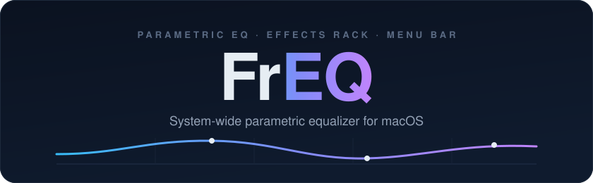
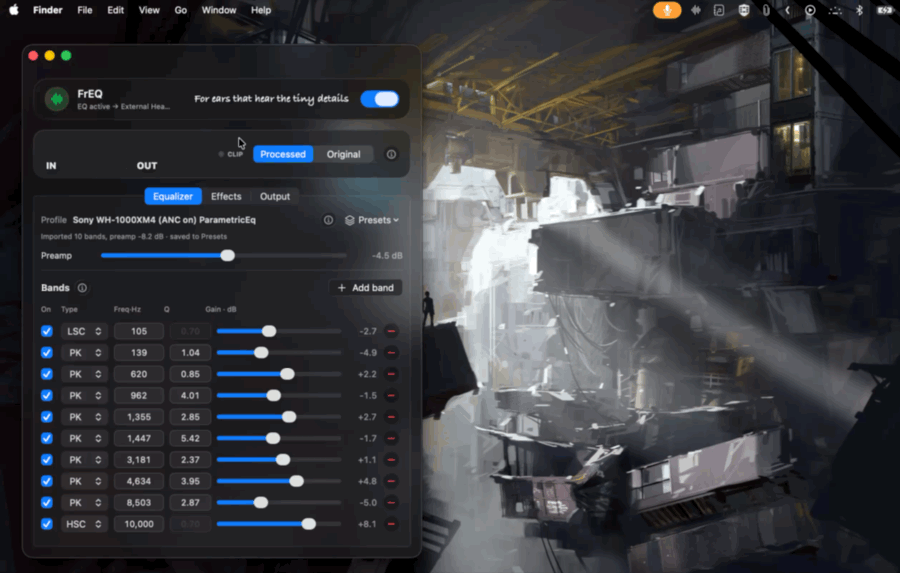

<div align="center">



**A lean, native, system-wide parametric equalizer for macOS — with AutoEq headphone-correction support and a full effects rack.**

[](#requirements)
[](#build)
[](#architecture)
[](#build)
[](LICENSE)

[Features](#features) · [How it works](#how-it-works) · [Install](#install) · [Effects](#effects-rack) · [Troubleshooting](#troubleshooting) · [FAQ](#limitations--non-goals)

</div>

---

**FrEQ** ( *freq*, as in **freq**uency — and it ends in **EQ** ) routes every app's audio through a
virtual output device, applies a parametric EQ + effects chain, and sends the result to your real
headphones or speakers. It's built for correcting headphone frequency response — e.g. the Sony
WH‑1000XM4 — using profiles from [jaakkopasanen/AutoEq](https://github.com/jaakkopasanen/AutoEq),
but it works as a general-purpose system EQ too.

- 🎚️ **All system audio → virtual device → parametric EQ → your real output device**
- 🍏 **Menu-bar only** (no Dock icon), **Apple frameworks only**, **universal binary**, **zero third-party deps**
- 🪟 **Liquid Glass UI** on macOS 26, with a clean `.regularMaterial` fallback down to macOS 13

> **Scope note.** FrEQ corrects frequency response only. It cannot change Bluetooth codec limitations
> (macOS supports SBC/AAC only — no LDAC/aptX) and cannot prevent the HFP mic-profile quality drop
> when an app uses the headset microphone. Those are macOS/Bluetooth constraints, not EQ problems.

## Demo

<p align="center">
  
</p>

> The **Equalizer** tab (WH‑1000XM4 profile, 10 bands + preamp), the **Processed / Original** A-B toggle,
> built-in presets & **Import AutoEq**, and the **Output** tab (device, latency presets, auto-enable).

## Features

| | |
|---|---|
| **System-wide** | Sits between every app and your output device — no per-app setup. |
| **AutoEq profiles** | Import any [AutoEq](https://github.com/jaakkopasanen/AutoEq) `ParametricEQ.txt` export (clipboard or file). Preamp applied automatically. |
| **Parametric EQ** | Up to 16 bands (peaking + low/high shelves) via `AVAudioUnitEQ`, plus preamp. |
| **Effects rack** | Tone, Bass Boost, Clarity, Tube Warmth, Crossfeed, Soundstage, Reverb, Compressor/AGC, and a Master Limiter — see [below](#effects-rack). |
| **Follows your output** | Change the output in Control Center and FrEQ re-targets it; handles Bluetooth drop/reconnect. |
| **True bypass** | Master toggle off returns the system default to your real device and adds **zero** latency. |
| **Volume keys work** | The virtual device exposes a volume/mute control the driver honors. |

## How it works

```
All apps
   ↓  (system default output)
FrEQ virtual device          ← Core Audio HAL plug-in (AudioServerPlugIn)
   ↓  loopback ring buffer inside the driver
FrEQ.app audio engine        ← captures the loopback stream (AUHAL)
   ↓  AVAudioUnitEQ (parametric bands + preamp) + effects chain
Real output device           ← headphones / speakers, user-selectable
```

Signal chain: `capture → enhancers/spatial (C DSP) → profile EQ → tone EQ → reverb → compressor → limiter → output`.

See **[docs/ARCHITECTURE.md](docs/ARCHITECTURE.md)** for the full architecture note (driver ↔ app
transport, clocking, drift handling).

### Components

| Path | What it is |
|---|---|
| `Driver/` | Core Audio HAL plug-in (C). Publishes the "FrEQ" virtual device. |
| `App/` | Menu-bar host app (Swift/SwiftUI). Capture, EQ, effects, rendering, UI. |
| `Tests/` | Ring-buffer, DSP, driver-host, and AutoEq-parser test harnesses. |
| `scripts/` | Build / install / uninstall / test / DMG scripts. |
| `Profiles/` | Example AutoEq ParametricEQ profile (WH‑1000XM4-style). |

## Requirements

- macOS 13 (Ventura) or later — Intel or Apple Silicon.
- **Xcode Command Line Tools** (`xcode-select --install`). Full Xcode is *not* required.
- No third-party dependencies.

## Install

### From source

```sh
git clone https://github.com/wannabemrrobot/FrEQ.git
cd FrEQ
make            # builds build/FrEQ.driver and build/FrEQ.app (universal, ad-hoc signed)
make test       # runs the ring-buffer, DSP, driver-host, and parser suites
make install    # sudo: installs the driver, restarts coreaudiod, copies the app to /Applications
```

Or step by step:

```sh
scripts/build-driver.sh
scripts/install-driver.sh          # sudo; briefly interrupts system audio
cp -R build/FrEQ.app /Applications/
open /Applications/FrEQ.app
```

Installing the driver restarts `coreaudiod`, which pauses all system audio for about a second. After
it restarts, a **FrEQ** device appears in System Settings → Sound → Output.

### Share it as a DMG

```sh
make dmg         # builds build/FrEQ.dmg (universal app + driver + double-clickable installer)
```

The disk image bundles the app, the HAL driver, and an **Install FrEQ.command** that installs both
(one password prompt) and restarts the audio server. Recipients on another Mac right-click → **Open**
the installer once (unidentified developer) unless you sign + notarize — see
**[docs/DISTRIBUTION.md](docs/DISTRIBUTION.md)** for the Developer ID / notarization path.

### First run

1. Launch FrEQ (slider icon in the menu bar). Clicking it opens a compact dropdown; **Open Controls…**
   opens the full resizable window with **Equalizer**, **Effects**, and **Output** tabs.
2. Toggle the switch on. macOS will ask for **microphone access** — this is expected: macOS treats
   *any* audio-input stream, including our loopback virtual device, as a microphone. FrEQ only reads
   the system-audio loopback; it never touches a physical microphone.
3. FrEQ makes its virtual device the system default output and renders the processed stream to the
   device shown in the **Output** tab ("Automatic" = whatever was default before).
4. Import a profile: **Equalizer** tab → **Import AutoEq** → *From clipboard* or *Choose .txt file…*.

### Getting AutoEq profiles

On [autoeq.app](https://autoeq.app), pick your headphone and select **EqualizerAPO / ParametricEq**
as the export format, then copy the text and use *Import AutoEq → From clipboard*. Or, from the
[AutoEq results](https://github.com/jaakkopasanen/AutoEq/tree/master/results) tree, download the file
ending in **`ParametricEQ.txt`** (e.g. `Sony WH-1000XM4 ParametricEQ.txt`) and import it.

The **Preamp** line from the profile is applied as a global pre-gain (negative, to prevent clipping
from boosted bands) — imported automatically. The bundled `Profiles/Sony WH-1000XM4.txt` is a
representative example of the format; prefer the current file from the AutoEq repo for real listening.

> FrEQ is not affiliated with the AutoEq project — it simply consumes AutoEq's ParametricEQ export format.

## Effects rack

Beyond the parametric EQ, FrEQ ships a ViPER4FX-style effects suite (**Effects** tab). Everything is
persisted, applies live and click-free, and is fully bypassed when disabled:

| Effect | What it does |
|---|---|
| **Tone** | Bass / Mids / Treble ±12 dB (low shelf 105 Hz, wide 1 kHz bell, high shelf 7.5 kHz) with automatic headroom. |
| **Bass Boost** | Dedicated low-shelf boost, strength 0–12 dB, corner 40–200 Hz. |
| **Clarity** | High-band exciter: adds sparkle above ~7 kHz without touching the mids. |
| **Tube Warmth** | Subtle asymmetric tube-style saturation (even harmonics), level-matched. |
| **Crossfeed** | Meier-style headphone crossfeed — blends low-frequency stereo like speakers in a room; mono-safe. |
| **Soundstage** | Stereo width 0–200 % (mid/side) and L/R balance. |
| **Reverb** | Apple's room-simulation reverb, 9 presets + wet/dry mix. |
| **Compressor / AGC** | Full dynamics processor: threshold, knee, attack, release, makeup gain. |
| **Master Limiter** | Peak limiter at the end of the chain (on by default) — protects against clipping from any combination of boosts. |

## Usage notes

- **Switching outputs**: pick a device in the FrEQ menu, or just change the output in System
  Settings / Control Center — FrEQ adopts that device as its EQ target and takes the default back.
- **Bluetooth reconnects** are handled: when your headphones drop, FrEQ falls back to another output;
  when they return, it switches back.
- **Latency**: three presets (~25 / 45 / 85 ms end-to-end). Higher = more robust against buffer
  underruns. A small constant latency is inherent to the virtual-device approach (fine for
  music/video — players compensate A/V sync; avoid for rhythm games or live monitoring).
- **Master toggle off** = full bypass: the system default output returns to your real device and FrEQ
  adds zero latency.

## Build

```sh
make            # driver + app, universal (arm64 + x86_64), lipo'd together, ad-hoc signed
make driver     # the HAL plug-in only
make app        # the menu-bar app only
make test       # all test suites
make clean       # remove build products
```

Both build scripts compile arm64 + x86_64 with plain `clang`/`swiftc` and `lipo` them together;
products are ad-hoc signed by default (fine for local use).

> **Xcode users:** the repo intentionally builds with plain `clang`/`swiftc` scripts so it works
> without full Xcode. To work in Xcode, create a project with two external-build-system targets
> pointing at `scripts/build-driver.sh` and `scripts/build-app.sh`, or add the `Driver/` and
> `App/Sources/` files to native Bundle/App targets (bridging header: `App/Sources/BridgingHeader.h`;
> the app needs `LSUIElement` and `NSMicrophoneUsageDescription` from `App/Resources/Info.plist`).

### Signing & notarization (distribution)

Local development works with the default ad-hoc signature: `coreaudiod` loads ad-hoc-signed HAL
plug-ins on a normal SIP-enabled system. **Do not** disable SIP or AMFI for this project. For
distribution to other machines:

```sh
make SIGN="Developer ID Application: Your Name (TEAMID)"
```

This signs the driver with Developer ID and the app with Developer ID + hardened runtime +
`com.apple.security.device.audio-input` entitlement (`App/Resources/FrEQ.entitlements`). Then
notarize and staple both products — full commands in **[docs/DISTRIBUTION.md](docs/DISTRIBUTION.md)**.

## Uninstall

```sh
make uninstall        # or scripts/uninstall.sh
```

Removes `/Library/Audio/Plug-Ins/HAL/FrEQ.driver`, `/Applications/FrEQ.app`, restarts `coreaudiod`,
and clears the app's saved settings.

## Troubleshooting

- **FrEQ device doesn't appear** after install:
  `log show --last 5m --predicate 'process == "coreaudiod"' | grep -i freq` — look for load or
  code-signature errors, then re-run `scripts/install-driver.sh`.
- **No sound with EQ enabled**: check the app's status line; verify microphone permission
  (System Settings → Privacy & Security → Microphone → FrEQ).
- **Crackles / dropouts**: raise the Latency preset. Bluetooth devices under RF interference
  sometimes need "High".
- **Audio stuck on the FrEQ device** (e.g. the app crashed): open System Settings → Sound and select
  your real output device, or relaunch FrEQ and toggle it off.
- **Debug log**: launch with `FREQ_DEBUG=1` and read `/tmp/freq-debug.log`.

## Limitations / non-goals

- Fixed stereo (2-channel) path.
- One capture client: the loopback input stream is meant for FrEQ.app only; it's hidden from
  "default input" selection but visible to apps that enumerate all devices.
- No LDAC/aptX, no HFP fixes (see the scope note above).
- AutoEq's `LSC`/`HSC` shelf Q is approximated by `AVAudioUnitEQ`'s standard shelf slope (AutoEq
  exports use Q 0.70 ≈ the same slope, so in practice the response matches).

## Acknowledgements

- [**jaakkopasanen/AutoEq**](https://github.com/jaakkopasanen/AutoEq) — the headphone measurement
  database and ParametricEQ export format FrEQ imports. FrEQ is an independent project and is not
  affiliated with or endorsed by AutoEq.
- Built on Apple's Core Audio, AudioServerPlugIn, AVAudioEngine, and SwiftUI.

## License

[MIT](LICENSE) © wannabemrrobot
